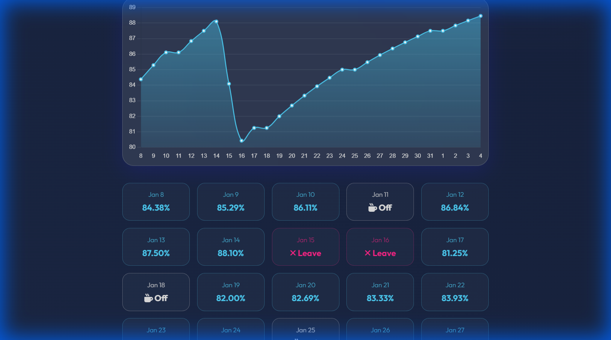
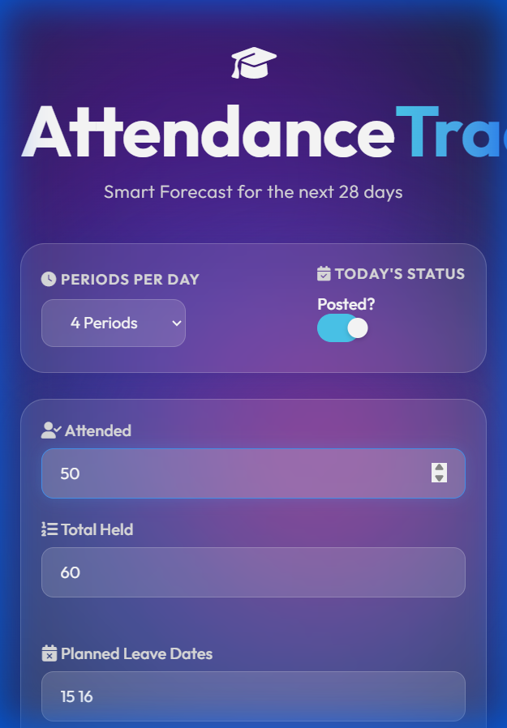

# 📈 Smart Attendance Tracker

> **Forecast your academic attendance with precision.**
> A powerful, real-time tool featuring a premium Glassmorphism UI, interactive charts, and intelligent date parsing.

 

  

## 🚀 Overview

**Attendance Tracker** solves the anxiety of "Can I take a leave tomorrow?". 
It goes beyond simple calculation by projecting your attendance percentage for the next **28 days**, accounting for:
*   Daily Schedule (Periods per day)
*   Sundays (Auto-detected)
*   Holidays
*   Planned Leaves

## 📸 Screenshots

| **Interactive Dashboard** | **Smart Forecasts** |
|:---:|:---:|
|  |  |
| *Clean, Dark Mode Interface* | *Real-time Trends & Daily Status* |

  <b>📱 Fully Responsive Mobile Design</b> 
  

## ✨ Key Features

*   **🎨 Premium Glassmorphism UI**: A visually stunning interface with deep gradients, animated backgrounds, and glass-panel aesthetics.
*   **⚡ Real-Time Visualization**: Powered by **Chart.js**, see your attendance trend line instantly update as you type.
*   **💾 Auto-Save**: Never lose your data. Input values are persisted locally so you can pick up exactly where you left off.
*   **🧠 Intelligent Logic**: Automatically filters out Sundays and processes complex leave dates seamlessly.

## 🛠️ How to Use

1.  ** Configure**: Select periods per day (e.g., 7).
2.  ** Input**: Enter your current attendance (e.g., 50/60).
3.  ** Plan**: Type dates for leaves (e.g., `12 15`) and holidays.
4.  ** Visualize**: Click **Calculate** to see your 28-day forecast.

## 👥 Author

**Siddem Anil Kumar**

*   📧 Email: [siddemanilkumar@gmail.com](mailto:siddemanilkumar@gmail.com)
*   💻 GitHub: [Anil2995](https://github.com/Anil2995)

---

## 📦 Tech Stack

- **Core**: HTML5, CSS3 (Glassmorphism), JavaScript (ES6+)
- **Libraries**: [Chart.js](https://www.chartjs.org/) (Visualization), [FontAwesome](https://fontawesome.com/) (Icons), [Outfit Font](https://fonts.google.com/specimen/Outfit) (Typography).

---
*Built with ❤️ & Smart Logic.*
